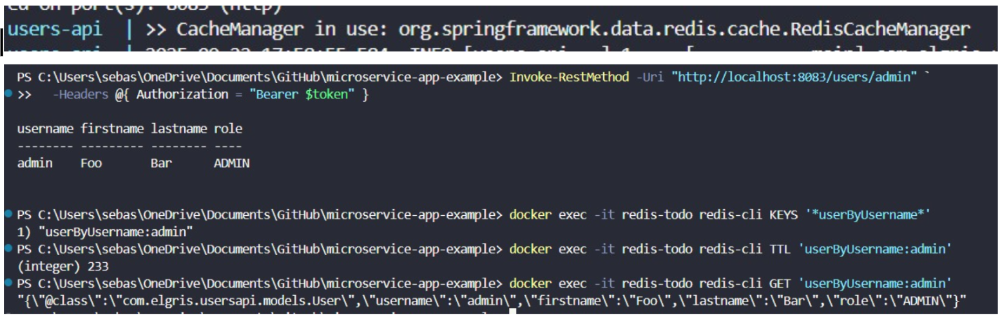
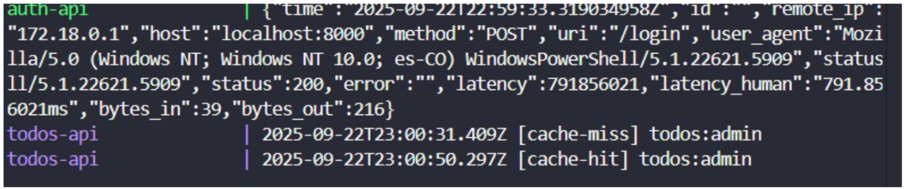
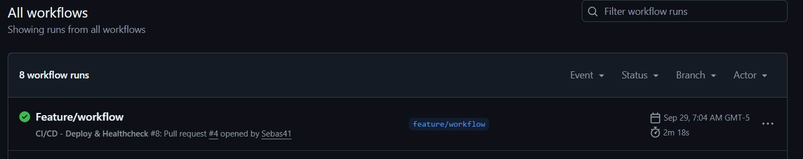

## Ingesoft 5 - Martín Cifuentes A00300016 - Sebastian Erazo A00400086

## Estrategia de Branching Desarrollo

- `main` : rama estable, protegida  
- `develop` : rama de integración continua  
- `feature/*` : nuevas funcionalidades por servicio  
- `hotfix/*` : correcciones urgentes

### Reglas generales de Pull Request (PR)

- Las PRs deben ser revisadas por al menos un revisor  
- Debe ejecutarse `terraform plan` (o comando equivalente) como validación  
- No se permite merge directo a ramas protegidas sin pasar las validaciones  

# Patrones implementados: Cache-Aside y Circuit Breaker

Este documento resume la implementación de **Cache-Aside** y **Circuit Breaker** dentro del proyecto de microservicios, usando las APIs `users-api` y `todos-api`.

## Arquitectura

- **users-api**: CRUD de usuarios y perfil básico.  
- **todos-api**: Maneja TODOs y consulta a `users-api` para enriquecer datos.  
- **Redis (Cache-aside)**:  
  - Claves: `user:{id}` y `todos:user:{id}`  
  - TTL: usuarios `300s`, todos `60–120s`  
- **Circuit Breaker** (en `todos-api` para llamadas a `users-api`):  
  - Timeout: 1–2s  
  - FailureRateThreshold: ~50%  
  - Ventana: 10–20 requests  
  - Estados: `CLOSED → OPEN → HALF-OPEN`  
  - Fallback: cache o datos mínimos

## Flujo Cache-Aside

1. **GET**: busca en Redis, si no está → consulta DB/servicio y guarda en cache.  
2. **POST/PUT/DELETE**: escribe en DB y elimina la clave en Redis.  
3. **GET /todos**:  
   - Usa Redis para datos de usuario.  
   - Si miss → llama a `users-api` (bajo breaker).  
   - Si breaker abierto → usa cache/fallback.  

## Circuit Breaker

- Implementado en **todos-api**.  
- Protege llamadas HTTP hacia `users-api`.  
- Estrategia:  
  - Si breaker **OPEN** → usar cache.  
  - Si no hay cache → respuesta degradada (mínima).  
  - Al recuperar `users-api`, breaker pasa de **HALF-OPEN → CLOSED**.  

## Endpoints principales

- **users-api**:  
  - `GET /users/:id`  
  - `PUT /users/:id`  

- **todos-api**:  
  - `GET /todos?userId=:id`  
  - `GET /health`  

## Pruebas realizadas

1. **Cache hits/misses**: primer GET es miss, siguientes son hit; TTL verificado.
  
  
2. **Invalidate on write**: PUT elimina clave, siguiente GET repuebla.  
3. **Circuit Breaker**:  
   - Simular fallos en `users-api` → breaker abre.  
   - `todos-api` responde desde cache o fallback.  
   - Al recuperarse, breaker cierra.  
4. **Carga ligera**: mejora tiempos con cache.  

## Observabilidad

- Logs con:  
  - `cache_event`  
  - `breaker_state`  
  - `latency_ms`  
  - `traceId`  

- Health checks: `GET /health`  
- Métricas opcionales integrables.
---

# Microservice App - PRFT Devops Training

This is the application you are going to use through the whole traninig. This, hopefully, will teach you the fundamentals you need in a real project. You will find a basic TODO application designed with a [microservice architecture](https://microservices.io). Although is a TODO application, it is interesting because the microservices that compose it are written in different programming language or frameworks (Go, Python, Vue, Java, and NodeJS). With this design you will experiment with multiple build tools and environments. 

## Components
In each folder you can find a more in-depth explanation of each component:

1. [Users API](/users-api) is a Spring Boot application. Provides user profiles. At the moment, does not provide full CRUD, just getting a single user and all users.
2. [Auth API](/auth-api) is a Go application, and provides authorization functionality. Generates [JWT](https://jwt.io/) tokens to be used with other APIs.
3. [TODOs API](/todos-api) is a NodeJS application, provides CRUD functionality over user's TODO records. Also, it logs "create" and "delete" operations to [Redis](https://redis.io/) queue.
4. [Log Message Processor](/log-message-processor) is a queue processor written in Python. Its purpose is to read messages from a Redis queue and print them to standard output.
5. [Frontend](/frontend) Vue application, provides UI.

## Architecture

Take a look at the components diagram that describes them and their interactions.

## CI/CD - Deploy & Healthcheck

This repository includes a **GitHub Actions workflow** (`.github/workflows/deploy-healthcheck.yml`) that automates deployment and validates the health of the microservices after startup.  

### Workflow Triggers
- Runs on every `push` to the branches `dev` or `develop`.  
- Runs for every Pull Request.  
- Can also be triggered manually (`workflow_dispatch`).  

### Steps Overview

1. **Checkout repository**  
   Downloads the code so Docker Compose can be executed.  

2. **Ensure Docker Compose is available**  
   Verifies if the `docker compose` command is installed; if not, falls back to legacy `docker-compose`.  

3. **Start services**  
   Executes `docker compose up -d` to bring up all the microservices defined in the `docker-compose.yml`.  

4. **Wait for services**  
   Waits 20 seconds to allow all containers to start.  

5. **Healthcheck: Frontend**  
   - Sends an HTTP request to `http://localhost:3000`.  
   - Fails if the response code is not **200**.  

6. **Healthcheck: Auth API**  
   - Checks `/version` endpoint at `http://localhost:8000/version`.  
   - Validates that the service is reachable.  

7. **Get JWT from Auth API**  
   - Installs `jq` to parse JSON responses.  
   - Requests a token from `/login` using default admin credentials (`admin/admin`).  
   - Exports the token to be used by other services.  

8. **Healthcheck: Todos API**  
   - Calls `http://localhost:8082/todos` with the JWT obtained from Auth API.  
   - Ensures the service responds with HTTP **200**.  

9. **Log Message Processor Note**  
   - This service does not expose HTTP endpoints, so it is skipped in the healthcheck.  

10. **Tear down services**  
    - Runs `docker compose down` to stop and clean up containers, even if the job fails.

### Benefits
- **Automated Verification**: Confirms that all services start and are accessible.  
- **Early Detection**: Identifies issues in integration between services before merging.  
- **Reusable**: Can be triggered manually for testing deployments.  
- **Consistency**: Standardizes validation of microservices health across environments.  